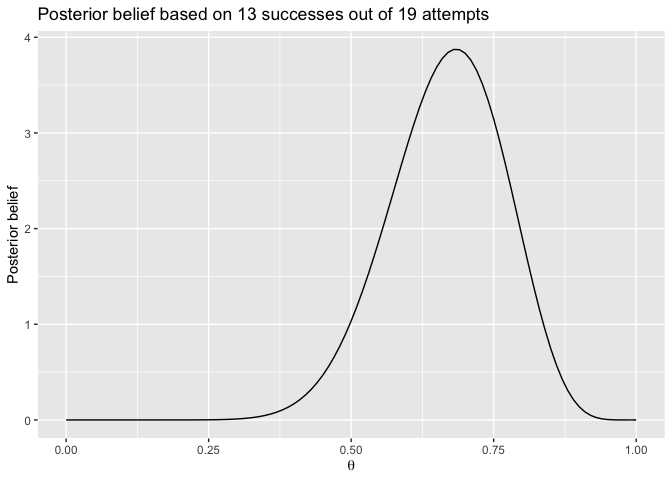
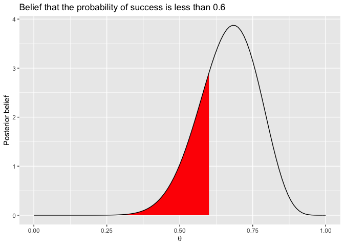
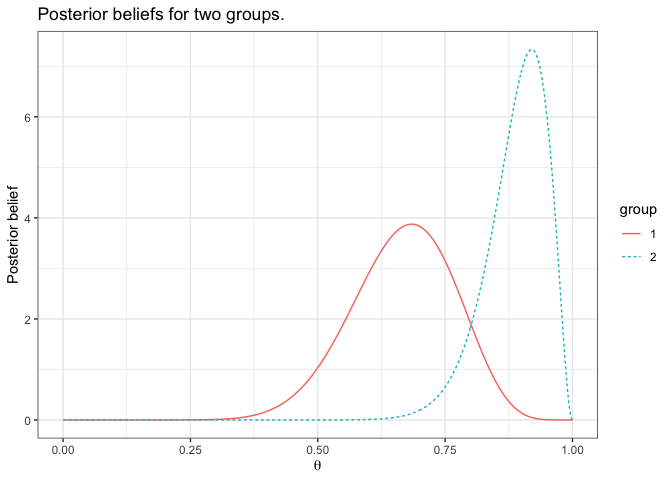

HCI/PSYCH 522
================



This page provides a summary of statistical methods in R used to analyze
binomial data. It begins by considering a single group and then expands
to multiple groups. For completing course activities, you should copy
relevant code from here and modifying it as necessary.

In the code below, we will make use of the `tidyverse` package, so make
sure to load it at the beginning of your R session.

``` r
library("tidyverse")
```

    ## ── Attaching packages ─────────────────────────────────────── tidyverse 1.3.1 ──

    ## ✓ ggplot2 3.3.5     ✓ purrr   0.3.4
    ## ✓ tibble  3.1.6     ✓ dplyr   1.0.7
    ## ✓ tidyr   1.1.4     ✓ stringr 1.4.0
    ## ✓ readr   1.4.0     ✓ forcats 0.5.1

    ## ── Conflicts ────────────────────────────────────────── tidyverse_conflicts() ──
    ## x dplyr::filter() masks stats::filter()
    ## x dplyr::lag()    masks stats::lag()

## Single group

Binomial data, written *Y* ∼ *B**i**n*(*n*, *θ*) is characterized by

-   *y* successes out of *n* attempts,
-   common probability of success *θ*,
-   and each attempt is independent.

If our sample is based on a random sample from our population, then we
can make inferences about that entire population.

Suppose we observe 13 successes out of 19 attempts. In R, we would write

``` r
y <- 13
n <- 19
```

A point estimate divides the 13 successes by the 19 attempts, i.e. 

``` r
y/n
```

    ## [1] 0.6842105

Our posterior belief is represented by the following curve

``` r
d <- data.frame(x = seq(from = 0, to = 1, length = 1001))

ggplot(d) + 
  stat_function(fun = dbeta, 
                args = list(shape1 = 1+y, shape2 = 1+n-y)) + 
  labs(x = expression(theta),
       y = "Posterior belief",
       title = "Posterior belief based on 13 successes out of 19 attempts")
```

<!-- -->

We can calculate probabilities based on this curve by finding the area
under the curve. For example, to find the probability that *θ* is less
than 0.6 we use

``` r
pbeta(0.6, shape1 = 1+y, shape2 = 1+n-y)
```

    ## [1] 0.2500107

which corresponds to the area

``` r
d <- data.frame(x = seq(from = 0, to = 1, length = 1001))

ggplot(d) + 
  stat_function(fun = dbeta, xlim = c(0,0.6), geom = "area", fill = "red",
                args = list(shape1 = 1+y, shape2 = 1+n-y)) + 
  stat_function(fun = dbeta, 
                args = list(shape1 = 1+y, shape2 = 1+n-y)) +
  labs(x = expression(theta),
       y = "Posterior belief",
       title = "Belief that the probability of success is less than 0.6")
```

<!-- -->

To calculate the probability of being above 0.6 use

``` r
pbeta(0.6, shape1 = 1+y, shape2 = 1+n-y)
```

    ## [1] 0.2500107

A 95% credible interval is calculated using

``` r
a <- 0.05
qbeta(c(a/2, 1-a/2), shape1 = 1+y, shape2 = 1+n-y)
```

    ## [1] 0.4572108 0.8460908

## Multiple groups

Binomial data for multiple gruops is written
*Y*<sub>*i*</sub> ∼ *B**i**n*(*n*<sub>*i*</sub>, *θ*<sub>*i*</sub>) for
*i* = 1, …, *I* where *I* is the number of groups. For group *i*, we
have

-   *y*<sub>*i*</sub> successes out of *n*<sub>*i*</sub> attempts,
-   common within-group probability of success *θ*<sub>*i*</sub>,
-   and every attempt is independent.

If our sample is based on a random sample from our population, then we
can make inferences about that entire population.

Suppose we observe 13 success out of 19 attempts in group 1 and 23
success out of 25 attempts in group 2. We may code this up as

``` r
d <- tribble(
  ~group, ~successes, ~attempts,
       1,         13,        19,
       2,         23,        25
)
```

We can determine point estimates using

``` r
d %>% mutate(point_estimate = successes/attempts)
```

    ## # A tibble: 2 × 4
    ##   group successes attempts point_estimate
    ##   <dbl>     <dbl>    <dbl>          <dbl>
    ## 1     1        13       19          0.684
    ## 2     2        23       25          0.92

We can plot our posterior beliefs using the following code

``` r
# Function to create the posterior
create_posterior <- function(d) {
  y <- d$successes
  n <- d$attempts
  
  data.frame(theta = seq(0, 1, length=1001)) %>%
    mutate(posterior = dbeta(theta, shape1 = 1+y, shape2 = 1+n-y))
}

# Construct the curves
curves <- d %>%
  group_by(group) %>%
  do(create_posterior(.)) %>%
  mutate(group = factor(group)) # so that we can use it as a linetype

# Plot curves
ggplot(curves, aes(x = theta, y = posterior, color = group, linetype = group)) +
  geom_line() + 
  labs(x = expression(theta),
       y = "Posterior belief",
       title = "Posterior beliefs for two groups.") + 
  theme_bw()
```

<!-- -->

If we want to calculate beliefs that one groups probability of success
is larger than the other, we use a Monte Carlo approach. This approach
first simulates values for *θ*<sub>1</sub> and *θ*<sub>2</sub>.

``` r
n_reps <- 100000
theta1 <- rbeta(n_reps, shape1 = 1+d$successes[1], shape2 = 1+d$attempts[1]-d$successes[1])
theta2 <- rbeta(n_reps, shape1 = 1+d$successes[2], shape2 = 1+d$attempts[2]-d$successes[2])
```

Then we calculate the proportion of times that `theta1` is larger than
`theta2` which is calculated in R using the `mean` function.

``` r
mean(theta1 > theta2)
```

    ## [1] 0.02534

We can also use these samples to obtain a 95% credible interval for the
difference between the two probabilities of success.

``` r
a <- 1-0.95
quantile(theta1 - theta2, probs = c(a/2, 1-a/2))
```

    ##          2.5%         97.5% 
    ## -0.4553527410  0.0008948721

For additional groups a similar process can be followed.
