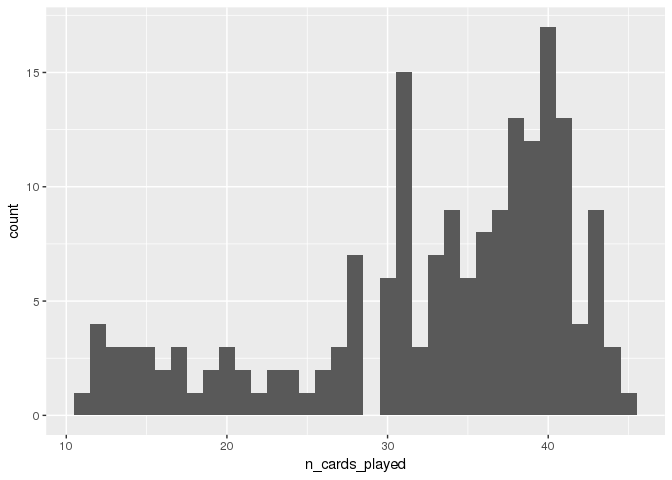
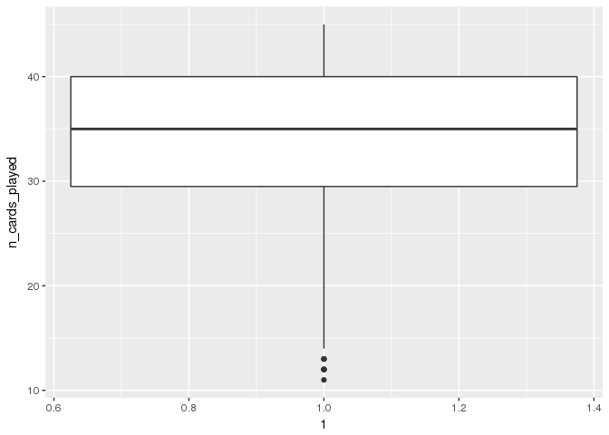
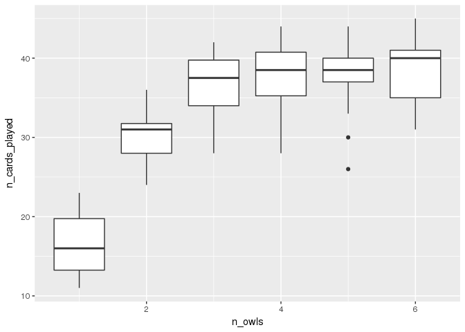
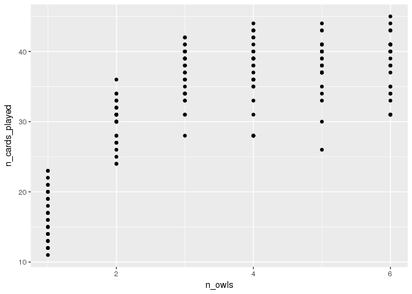
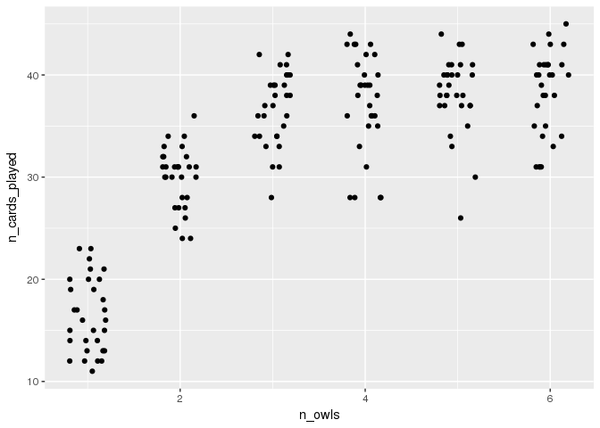
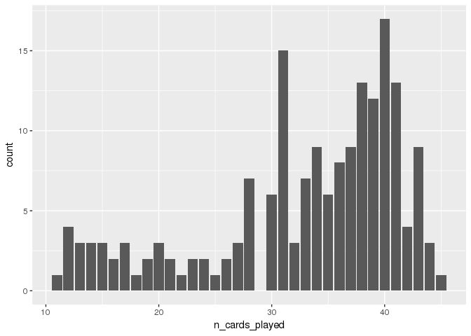
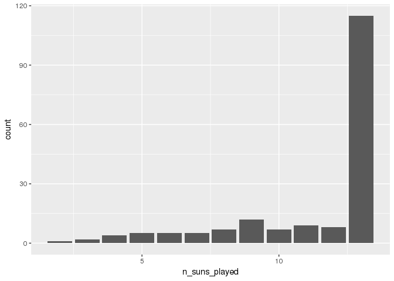
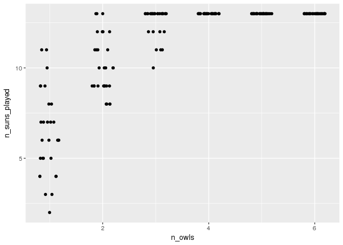

To follow along, use the [lab01 code](lab01.R).

Detailed introduction
---------------------

For an extremely detailed introduction, please see

``` r
help.start()
```

In this documentation, the above command will be executed at the command prompt, see below.

Brief introduction to R
-----------------------

From `help.start()`:

> R is an integrated suite of software facilities for data manipulation, calculation and graphical display.

and from <https://www.rstudio.com/products/RStudio/>:

> RStudio is an integrated development environment (IDE) for R.

### R interface

In contrast to many other statistical software packages that use a point-and-click interface, e.g. SPSS, JMP, Stata, etc, R has a command-line interface. The command line has a command prompt, e.g. `>`, see below.

``` r
>
```

This means, that you will be entering commands on this command line and hitting enter to execute them, e.g.

``` r
help()
```

Use the **up arrow** to recover past commands.

``` r
hepl()
help() # Use up arrow and fix
```

### R GUI (or [RStudio](http://www.rstudio.com/))

Most likely, you are using a graphical user interface (GUI) and therefore, in addition, to the command line, you also have a windowed version of R with some point-and-click options, e.g. File, Edit, and Help.

In particular, there is an editor to create a new R script. So rather than entering commands on the command line, you will write commands in a script and then send those commands to the command line using `Ctrl-R` (PC) or `Command-Enter` (Mac).

``` r
a = 1 
b = 2
a+b
```

    ## [1] 3

Multiple lines can be run in sequence by selecting them and then using `Ctrl-R` (PC) or `Command-Enter` (Mac).

### Intro Activity

One of the most effective ways to use this documentation is to cut-and-paste the commands into a script and then execute them.

Cut-and-paste the following commands into a **new script** and then run those commands directly from the script using `Ctrl-R` (PC) or `Command-Enter` (Mac).

``` r
x = 1:10
y = rep(c(1,2), each=5)
m = lm(y~x)
s = summary(m)
```

Now, look at the result of each line

``` r
x
y
m
s
s$r.squared
```

``` r
x
```

    ##  [1]  1  2  3  4  5  6  7  8  9 10

``` r
y
```

    ##  [1] 1 1 1 1 1 2 2 2 2 2

``` r
m
```

    ## 
    ## Call:
    ## lm(formula = y ~ x)
    ## 
    ## Coefficients:
    ## (Intercept)            x  
    ##      0.6667       0.1515

``` r
s
```

    ## 
    ## Call:
    ## lm(formula = y ~ x)
    ## 
    ## Residuals:
    ##     Min      1Q  Median      3Q     Max 
    ## -0.4242 -0.1667  0.0000  0.1667  0.4242 
    ## 
    ## Coefficients:
    ##             Estimate Std. Error t value Pr(>|t|)   
    ## (Intercept)   0.6667     0.1880   3.546  0.00756 **
    ## x             0.1515     0.0303   5.000  0.00105 **
    ## ---
    ## Signif. codes:  0 '***' 0.001 '**' 0.01 '*' 0.05 '.' 0.1 ' ' 1
    ## 
    ## Residual standard error: 0.2752 on 8 degrees of freedom
    ## Multiple R-squared:  0.7576, Adjusted R-squared:  0.7273 
    ## F-statistic:    25 on 1 and 8 DF,  p-value: 0.001053

``` r
s$r.squared
```

    ## [1] 0.7575758

<button title="Show a solution" type="button" onclick="if(document.getElementById('copypaste_activity_solution') .style.display=='none') {document.getElementById('copypaste_activity_solution') .style.display=''}else{document.getElementById('copypaste_activity_solution') .style.display='none'}">
Show/Hide Solution
</button>
<a name="calculator"></a> Using R as a calculator
-------------------------------------------------

### Basic calculator operations

All basic calculator operations can be performed in R.

``` r
1+2
```

    ## [1] 3

``` r
1-2
```

    ## [1] -1

``` r
1/2
```

    ## [1] 0.5

``` r
1*2
```

    ## [1] 2

For now, you can ignore the \[1\] at the beginning of the line, we'll learn about that when we get to vectors.

### Advanced calculator operations

Many advanced calculator operations are also available.

``` r
(1+3)*2 + 100^2  # standard order of operations
```

    ## [1] 10008

``` r
sin(2*pi)        # the result is in scientific notation, i.e. -2.449294 x 10^-16 
```

    ## [1] -2.449294e-16

``` r
sqrt(4)
```

    ## [1] 2

``` r
10^2
```

    ## [1] 100

``` r
log(10)          # the default is base e
```

    ## [1] 2.302585

``` r
log(10, base=10)
```

    ## [1] 1

### Using variables

A real advantage to using R rather than a calculator (or calculator app) is the ability to store quantities using variables.

``` r
a = 1
b = 2
a+b
```

    ## [1] 3

``` r
a-b
```

    ## [1] -1

``` r
a/b
```

    ## [1] 0.5

``` r
a*b
```

    ## [1] 2

### Assignment operators =, &lt;-, and -&gt;

When assigning variables values, you can also use arrows &lt;- and -&gt; and you will often see this in code, e.g.

``` r
a <- 1
2 -> b
c = 3  # is the same as <-
```

Now print them.

``` r
a
```

    ## [1] 1

``` r
b
```

    ## [1] 2

``` r
c
```

    ## [1] 3

### Using informative variable names

While using variables alone is useful, it is much more useful to use informative variables names.

``` r
# Rectangle
length <- 4
width  <- 3

area <- length * width
area
```

    ## [1] 12

``` r
# Circle
radius <- 2
area   <- pi*radius^2 # this overwrites the previous `area` variable
circumference <- 2*pi*radius
area
```

    ## [1] 12.56637

``` r
circumference
```

    ## [1] 12.56637

``` r
# (Right) Triangle
opposite     <- 1
angleDegrees <- 30
angleRadians <- angleDegrees * pi/180
(adjacent     <- opposite / tan(angleRadians)) # = sqrt(3)
```

    ## [1] 1.732051

``` r
(hypotenuse   <- opposite / sin(angleRadians)) # = 2
```

    ## [1] 2

### Calculator Activity

#### [Bayes' Rule](http://en.wikipedia.org/wiki/Bayes%27_theorem)

Suppose an individual tests positive for a disease, what is the probability the individual has the disease? Let

-   \(D\) indicates the individual has the disease
-   \(N\) means the individual does not have the disease
-   \(+\) indicates a positive test result
-   \(-\) indicates a negative test

The above probability can be calculated using [Bayes' Rule](http://en.wikipedia.org/wiki/Bayes%27_rule):

\[ P(D|+) = \frac{P(+|D)P(D)}{P(+|D)P(D)+P(+|N)P(N)} = 
\frac{P(+|D)P(D)}{P(+|D)P(D)+(1-P(-|N))\times(1-P(D))} \]

where

-   \(P(+|D)\) is the [sensitivity](http://en.wikipedia.org/wiki/Sensitivity_and_specificity) of the test
-   \(P(-|N)\) is the [specificity](http://en.wikipedia.org/wiki/Sensitivity_and_specificity) of the test
-   \(P(D)\) is the [prevalence](http://en.wikipedia.org/wiki/Prevalence) of the disease

Calculate the probability the individual has the disease if the test is positive when

-   the specificity of the test is 0.95,
-   the sensitivity of the test is 0.99, and
-   the prevalence of the disease is 0.001.

``` r
specificity = 0.95
sensitivity = 0.99
prevalence = 0.001
probability = (sensitivity*prevalence) / (sensitivity*prevalence + (1-specificity)*(1-prevalence))
probability
```

    ## [1] 0.01943463

<button title="Show a solution" type="button" onclick="if(document.getElementById('bayesrule_activity_solution') .style.display=='none') {document.getElementById('bayesrule_activity_solution') .style.display=''}else{document.getElementById('bayesrule_activity_solution') .style.display='none'}">
Show/Hide Solution
</button>
<a name="types">Data types</a>
------------------------------

Objects in R can be broadly classified according to their dimensions:

-   scalar
-   vector
-   matrix
-   array (higher dimensional matrix)

and according to the type of variable they contain:

-   integer
-   numeric
-   character (string)
-   logical
-   factor

### Scalars

Scalars have a single value assigned to the object in R.

``` r
a = 3.14159265 
b = "STAT 401 (Eng)" 
c = TRUE
```

Print the objects

``` r
a
```

    ## [1] 3.141593

``` r
b
```

    ## [1] "STAT 401 (Eng)"

``` r
c
```

    ## [1] TRUE

### Vectors

The `c()` function creates a vector in R

``` r
a = c(1,2,-5,3.6)
b = c("STAT","401", "(Eng)")
c = c(TRUE, FALSE, TRUE, TRUE)
```

To determine the length of a vector in R use `length()`

``` r
length(a)
```

    ## [1] 4

``` r
length(b)
```

    ## [1] 3

``` r
length(c)
```

    ## [1] 4

To determine the type of a vector in R use `class()`

``` r
class(a)
```

    ## [1] "numeric"

``` r
class(b)
```

    ## [1] "character"

``` r
class(c)
```

    ## [1] "logical"

#### Vector construction

Create a numeric vector that is a sequence using : or `seq()`.

``` r
1:10
```

    ##  [1]  1  2  3  4  5  6  7  8  9 10

``` r
5:-2
```

    ## [1]  5  4  3  2  1  0 -1 -2

``` r
seq(from = 2, to = 5, by = .05)
```

    ##  [1] 2.00 2.05 2.10 2.15 2.20 2.25 2.30 2.35 2.40 2.45 2.50 2.55 2.60 2.65
    ## [15] 2.70 2.75 2.80 2.85 2.90 2.95 3.00 3.05 3.10 3.15 3.20 3.25 3.30 3.35
    ## [29] 3.40 3.45 3.50 3.55 3.60 3.65 3.70 3.75 3.80 3.85 3.90 3.95 4.00 4.05
    ## [43] 4.10 4.15 4.20 4.25 4.30 4.35 4.40 4.45 4.50 4.55 4.60 4.65 4.70 4.75
    ## [57] 4.80 4.85 4.90 4.95 5.00

Another useful function to create vectors is `rep()`

``` r
rep(1:4, times = 2)
```

    ## [1] 1 2 3 4 1 2 3 4

``` r
rep(1:4, each  = 2)
```

    ## [1] 1 1 2 2 3 3 4 4

``` r
rep(1:4, each  = 2, times = 2)
```

    ##  [1] 1 1 2 2 3 3 4 4 1 1 2 2 3 3 4 4

Arguments to functions in R can be referenced either by position or by name or both. The safest and easiest to read approach is to name all your arguments. I will often name all but the first argument.

#### Accessing vector elements

Elements of a vector can be accessed using brackets, e.g. \[index\].

``` r
a = c("one","two","three","four","five")
a[1]
```

    ## [1] "one"

``` r
a[2:4]
```

    ## [1] "two"   "three" "four"

``` r
a[c(3,5)]
```

    ## [1] "three" "five"

``` r
a[rep(3,4)]
```

    ## [1] "three" "three" "three" "three"

Alternatively we can access elements using a logical vector where only TRUE elements are accessed.

``` r
a[c(TRUE, TRUE, FALSE, FALSE, FALSE)]
```

    ## [1] "one" "two"

You can also remove elements using a negative sign `-`.

``` r
a[-1]
```

    ## [1] "two"   "three" "four"  "five"

``` r
a[-(2:3)]
```

    ## [1] "one"  "four" "five"

#### Modifying elements of a vector

You can assign new values to elements in a vector using = or &lt;-.

``` r
a[2] = "twenty-two"
a
```

    ## [1] "one"        "twenty-two" "three"      "four"       "five"

``` r
a[3:4] = "three-four" # assigns "three-four" to both the 3rd and 4th elements
a
```

    ## [1] "one"        "twenty-two" "three-four" "three-four" "five"

``` r
a[c(3,5)] = c("thirty-three","fifty-five")
a
```

    ## [1] "one"          "twenty-two"   "thirty-three" "three-four"  
    ## [5] "fifty-five"

### Matrices

Matrices can be constructed using `cbind()`, `rbind()`, and `matrix()`:

``` r
m1 = cbind(c(1,2), c(3,4))       # Column bind
m2 = rbind(c(1,3), c(2,4))       # Row bind

m1
```

    ##      [,1] [,2]
    ## [1,]    1    3
    ## [2,]    2    4

``` r
all.equal(m1, m2)
```

    ## [1] TRUE

``` r
m3 = matrix(1:4, nrow = 2, ncol = 2)
all.equal(m1, m3)
```

    ## [1] TRUE

``` r
m4 = matrix(1:4, nrow = 2, ncol = 2, byrow = TRUE)
all.equal(m3, m4)
```

    ## [1] "Mean relative difference: 0.4"

``` r
m3
```

    ##      [,1] [,2]
    ## [1,]    1    3
    ## [2,]    2    4

``` r
m4
```

    ##      [,1] [,2]
    ## [1,]    1    2
    ## [2,]    3    4

#### Accessing matrix elements

Elements of a matrix can be accessed using brackets separated by a comma, e.g. \[row index, column index\].

``` r
m = matrix(1:12, nrow=3, ncol=4)
m
```

    ##      [,1] [,2] [,3] [,4]
    ## [1,]    1    4    7   10
    ## [2,]    2    5    8   11
    ## [3,]    3    6    9   12

``` r
m[2,3]
```

    ## [1] 8

Multiple elements can be accessed at once

``` r
m[1:2,3:4]
```

    ##      [,1] [,2]
    ## [1,]    7   10
    ## [2,]    8   11

If no row (column) index is provided, then the whole row (column) is accessed.

``` r
m[1:2,]
```

    ##      [,1] [,2] [,3] [,4]
    ## [1,]    1    4    7   10
    ## [2,]    2    5    8   11

Like vectors, you can eliminate rows (or columns)

``` r
m[-c(3,4),]
```

    ##      [,1] [,2] [,3] [,4]
    ## [1,]    1    4    7   10
    ## [2,]    2    5    8   11

Be careful not to forget the comma, e.g.

``` r
m[1:4]
```

    ## [1] 1 2 3 4

You can also construct an object with more than 2 dimensions using the `array()` function.

### Cannot mix types

You cannot mix types within a vector, matrix, or array

``` r
c(1,"a")
```

    ## [1] "1" "a"

The number 1 is in quotes indicating that R is treating it as a character rather than a numeric.

``` r
c(TRUE, 1, FALSE)
```

    ## [1] 1 1 0

The logicals are converted to numeric (0 for FALSE and 1 for TRUE).

``` r
c(TRUE, 1, "a")
```

    ## [1] "TRUE" "1"    "a"

Everything is converted to a character.

### Activity

Reconstruct the following matrix using the `matrix()` function, then

1.  Print the element in the 3rd-row and 4th column
2.  Print the 2nd column
3.  Print all but the 3rd row

``` r
m = rbind(c(1, 12, 8, 6),
          c(4, 10, 2, 9),
          c(11, 3, 5, 7))
m
```

    ##      [,1] [,2] [,3] [,4]
    ## [1,]    1   12    8    6
    ## [2,]    4   10    2    9
    ## [3,]   11    3    5    7

``` r
# Reconstruct the matrix 
n = matrix(c(1,12,8,6,4,10,2,9,11,3,5,7), nrow=3, ncol=4, byrow=TRUE)
n
```

    ##      [,1] [,2] [,3] [,4]
    ## [1,]    1   12    8    6
    ## [2,]    4   10    2    9
    ## [3,]   11    3    5    7

``` r
all.equal(m,n)
```

    ## [1] TRUE

``` r
# Print the element in the 3rd-row and 4th column
n[3,4]
```

    ## [1] 7

``` r
# Print the 2nd column
n[,2]
```

    ## [1] 12 10  3

``` r
# Print all but the 3rd row
n[-3,]
```

    ##      [,1] [,2] [,3] [,4]
    ## [1,]    1   12    8    6
    ## [2,]    4   10    2    9

<button title="Show a solution" type="button" onclick="if(document.getElementById('matrix_activity_solution') .style.display=='none') {document.getElementById('matrix_activity_solution') .style.display=''}else{document.getElementById('matrix_activity_solution') .style.display='none'}">
Show/Hide Solution
</button>
<a name="frames">Data frames</a>
--------------------------------

A `data.frame` is a special type of matrix that allows different data types in different columns.

``` r
# Installs the HootOwlHoot package if it is not already installed
if (!requireNamespace("HootOwlHoot", quietly = TRUE))
  devtools::install_github("BoardGameSimulator/HootOwlHoot")

# Exp for experiment
Exp <- HootOwlHoot::run_experiments(n_reps = 10, n_players = 2:4, n_owls = 1:6)

class(Exp)
```

    ## [1] "data.frame"

### Access `data.frame` elements

A `data.frame` can be accessed just like a matrix, e.g. \[row index, column index\].

``` r
Exp[1:2, 1:3]
```

    ##   rep n_players n_owls
    ## 1   1         2      1
    ## 2   2         2      1

`data.frame`s can also be accessed by column names. In order to determine the column names use the `names()` function.

``` r
names(Exp)
```

    ## [1] "rep"                "n_players"          "n_owls"            
    ## [4] "n_cards_per_player" "win"                "n_cards_played"    
    ## [7] "n_suns_played"      "owl_score"          "n_owls_left"

``` r
Exp[1:2, c("rep","n_players", "n_owls")]
```

    ##   rep n_players n_owls
    ## 1   1         2      1
    ## 2   2         2      1

or

``` r
library('dplyr') 
Exp %>% 
  select(rep, n_players, n_owls) %>%
  head(n = 2)
```

    ##   rep n_players n_owls
    ## 1   1         2      1
    ## 2   2         2      1

The `%>%` (pipe) operator allows chaining of commands by passing the result of the previous command as the first argument of the next command. This makes code much easier to read. Two equivalent approaches that are harder to read are

``` r
# Approach 1
head(select(Exp, rep, n_players, n_owls), n = 2)

# Approach 2
Exp_select <- select(Exp, rep, n_players, n_owls)
head(Exp_select, n = 2)
```

When there are long strings of commands, using the `%>%` (pipe) operator makes code much easier to read. See [here](https://www.r-statistics.com/2014/08/simpler-r-coding-with-pipes-the-present-and-future-of-the-magrittr-package/) for more background and information.

### Different data types in different columns

The function `str()` allows you to see the structure of any object in R. Using `str()` on a `data.frame` object tells you

1.  that the object is a `data.frame`,
2.  the number of rows and columns,
3.  the names of each column,
4.  each column's data type, and
5.  the first few elements in that column.

``` r
str(Exp)
```

    ## 'data.frame':    180 obs. of  9 variables:
    ##  $ rep               : int  1 2 3 4 5 6 7 8 9 10 ...
    ##  $ n_players         : int  2 2 2 2 2 2 2 2 2 2 ...
    ##  $ n_owls            : int  1 1 1 1 1 1 1 1 1 1 ...
    ##  $ n_cards_per_player: num  3 3 3 3 3 3 3 3 3 3 ...
    ##  $ win               : logi  TRUE TRUE TRUE TRUE TRUE TRUE ...
    ##  $ n_cards_played    : int  12 20 15 13 18 12 23 14 21 11 ...
    ##  $ n_suns_played     : num  4 8 2 4 6 4 9 6 8 3 ...
    ##  $ owl_score         : int  0 0 0 0 0 0 0 0 0 0 ...
    ##  $ n_owls_left       : int  0 0 0 0 0 0 0 0 0 0 ...

<a name="aggregating">Aggregating data frames in R</a>
------------------------------------------------------

Each row in the `Exp` `data.frame` is a simulated game and e may want to aggregate this information. To do so, we will use the `group_by()` and `summarize()` functions in the `dplyr` package.

``` r
library('dplyr')
```

For example, perhaps we wanted to know the proportion of games won across the number of owls in play

``` r
Exp %>%                           
  group_by(n_owls) %>%        
  summarize(games_won = sum(win == TRUE),
            n_games = n(),                    # n() counts the number of rows in the grouped data.frame
            proportion = games_won / n_games) 
```

    ## # A tibble: 6 × 4
    ##   n_owls games_won n_games proportion
    ##    <int>     <int>   <int>      <dbl>
    ## 1      1        30      30  1.0000000
    ## 2      2        27      30  0.9000000
    ## 3      3         8      30  0.2666667
    ## 4      4         0      30  0.0000000
    ## 5      5         0      30  0.0000000
    ## 6      6         0      30  0.0000000

or, equivalently,

``` r
Exp %>%                           
  group_by(n_owls) %>%        
  summarize(proportion = mean(win)) # the logical `win` is implicitly converted to 0's and 1's 
```

    ## # A tibble: 6 × 2
    ##   n_owls proportion
    ##    <int>      <dbl>
    ## 1      1  1.0000000
    ## 2      2  0.9000000
    ## 3      3  0.2666667
    ## 4      4  0.0000000
    ## 5      5  0.0000000
    ## 6      6  0.0000000

### Aggregating the Exp data set

Let's aggregate the Exp data set by n\_players and n\_owls.

``` r
Exp %>%                           
  group_by(n_players, n_owls) %>%        
  summarize(proportion = mean(win)) # the logical `win` is implicitly converted to 0's and 1's 
```

    ## Source: local data frame [18 x 3]
    ## Groups: n_players [?]
    ## 
    ##    n_players n_owls proportion
    ##        <int>  <int>      <dbl>
    ## 1          2      1        1.0
    ## 2          2      2        0.9
    ## 3          2      3        0.3
    ## 4          2      4        0.0
    ## 5          2      5        0.0
    ## 6          2      6        0.0
    ## 7          3      1        1.0
    ## 8          3      2        1.0
    ## 9          3      3        0.3
    ## 10         3      4        0.0
    ## 11         3      5        0.0
    ## 12         3      6        0.0
    ## 13         4      1        1.0
    ## 14         4      2        0.8
    ## 15         4      3        0.2
    ## 16         4      4        0.0
    ## 17         4      5        0.0
    ## 18         4      6        0.0

### Activity

Calculate the average number of cards played by the number of players in the game

``` r
Exp %>%                           
  group_by(n_players) %>%        
  summarize(average_cards_played = mean(n_cards_played)) 
```

    ## # A tibble: 3 × 2
    ##   n_players average_cards_played
    ##       <int>                <dbl>
    ## 1         2             33.65000
    ## 2         3             32.95000
    ## 3         4             31.93333

<button title="Show a solution" type="button" onclick="if(document.getElementById('aggregate_activity_solution') .style.display=='none') {document.getElementById('aggregate_activity_solution') .style.display=''}else{document.getElementById('aggregate_activity_solution') .style.display='none'}">
Show/Hide Solution
</button>
<a name="ggplot2">Basics of `ggplot2`</a>
-----------------------------------------

There is a base graphics system in R, but I highly prefer the `ggplot2` system for graphics and thus, I will completey ignore the base system (although you may see some plots in lecture using the base system).

Load the `ggplot2` package

``` r
library('ggplot2')
```

### Histogram

A basic histogram in ggplot

``` r
ggplot(data = Exp, aes(x = n_cards_played)) + geom_histogram(binwidth = 1)
```



For code that looks more similar to base graphics in R, you can use

``` r
qplot(data = Exp, x = age, geom = "histogram", binwidth = 1)
```

Many websites and even the `ggplot2` manual have examples using `qplot`. I believe this is mainly to ease the transition for individuals who are familiar with base `graphics`. If you are just starting out with R, I recommend using the `ggplot` function in `ggplot2` from the beginning.

### Boxplots

A basic boxplot

``` r
ggplot(data = Exp, aes(x = 1, y = n_cards_played)) + geom_boxplot()
```



### Multiple boxplots

``` r
ggplot(Exp, aes(x = n_owls, y = n_cards_played, group = n_owls)) + geom_boxplot()
```



### Scatterplots

``` r
ggplot(Exp, aes(x=n_owls, y = n_cards_played)) + geom_point()
```



some of these points might be overplotted, so we will jitter (add a little random number to move the points on the x-axis) them

``` r
ggplot(Exp, aes(x=n_owls, y = n_cards_played)) + geom_jitter(width=0.2, height=0)
```



### Bar charts

With ggplot, there is no need to count first.

``` r
ggplot(Exp, aes(x=n_cards_played)) + geom_bar()
```



An appealing aspect of \``ggplot` is that once the data is in the correct format it is easy to construct lots of different plots.

### Activity

Construct a bar chart for the number of suns played. Then construct a jittered (jitter only the x-axis) scatter plot for the number of suns played as a function of the number of owls.

``` r
# Construct bar chart for the number of suns played.

# Construct a jittered scatter plot for the number of suns played as a function 
# of the number of owls.
```

``` r
ggplot(Exp, aes(x=n_suns_played)) + 
  geom_bar()
```



``` r
ggplot(Exp, aes(x = n_owls, y = n_suns_played)) + 
  geom_jitter(width = 0.2, height = 0)
```



<button title="Show a solution" type="button" onclick="if(document.getElementById('ggplot2_activity_solution') .style.display=='none') {document.getElementById('ggplot2_activity_solution') .style.display=''}else{document.getElementById('ggplot2_activity_solution') .style.display='none'}">
Show/Hide Solution
</button>
<a name="help"></a> Getting help for R
--------------------------------------

As you work with R, there will be many times when you need to get help.

My basic approach is

1.  Use the help contained within R
2.  Perform an internet search for an answer
3.  Find somebody else who knows

In all cases, knowing the R keywords, e.g. a function name, will be extremely helpful.

### Help within R I

If you know the function name, then you can use `?<function>`, e.g.

``` r
?mean
```

The structure of help is - Description: quick description of what the function does - Usage: the arguments, their order, and default values (if any) - Arguments: more thorough description about the arguments - Value: what the funtion returns - See Also: similar functions - Examples: examples of how to use the function

### Help within R II

If you cannot remember the function name, then you can use `help.search("<something>")`, e.g.

``` r
help.search("mean")
```

Depending on how many packages you have installed, you will find a lot or a little here.

### Internet search for R help

I google for `<something> R`, e.g.

    calculate mean R

Some useful sites are

-   <http://www.cookbook-r.com/>
-   <http://www.r-tutor.com/r-introduction>
-   <http://www.statmethods.net/>
-   <http://stackoverflow.com/questions/tagged/r>
-   <http://www.ats.ucla.edu/stat/r/>
-   <https://sites.google.com/site/rapplicationforbiosurveillance/home/discussions>

### <a name="help">Getting help on ggplot2</a>

Although the general R help can still be used, e.g.

``` r
?ggplot
?geom_point
```

It is much more helpful to google for an answer

    geom_point 
    ggplot2 line colors

The top hits will all have the code along with what the code produces.

#### Helpful sites

These sites all provide code. The first two also provide the plots that are produced.

-   <http://docs.ggplot2.org/current/>
-   <http://www.cookbook-r.com/Graphs/>
-   <http://stackoverflow.com/questions/tagged/ggplot2>
