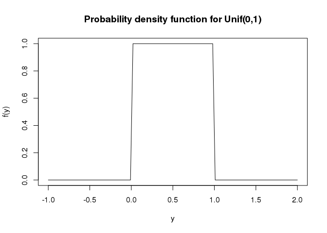
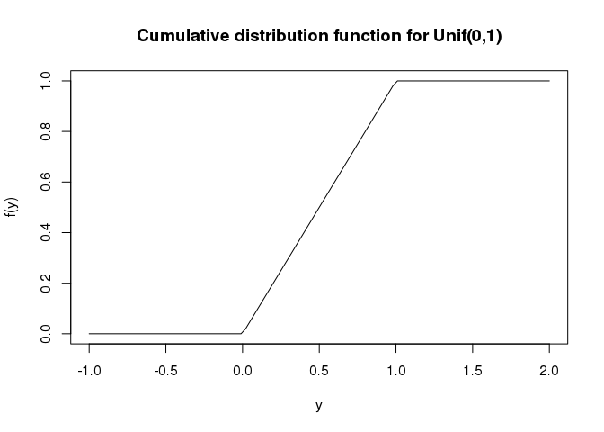

To follow along, use the [lab02 code](lab02.R).

Probability distributions in R
------------------------------

Many of the standard probability distributions have functions in R to calculate:

-   probability density/mass function (d)
-   cumulative distribution function (p)
-   quantile function (q)
-   random draws (r)

The letter after each indicates the letter the function will start with for all distributions.

### Uniform distribution

The uniform distribution is one of the easiest distributions to understand. If Y is a random variable and it is uniformly distributed between a and b, then we write \(Y \sim Unif(a,b)\).

#### Probability density function

The probability density function for a uniform random variable is zero outside of a and b (indicating that the random variable cannot take values below a or above b) and is constant at a value of 1/(b-a) from a to b.

``` r
a <- 0
b <- 1
curve(dunif(x, min = a, max = b), from = -1, to = 2,
      xlab='y', ylab='f(y)', main='Probability density function for Unif(0,1)')
```



#### Cumulative distribution function

The cumulative distribution function is the integral from negative infinite up to y of the probability density function. Thus it indicates the probability the random variables will take on values less than y, i.e. \(P(Y<y)\). Since the probability density function for the uniform is constant, the integral is simply zero from negative infinite up to a, then a straight line from (a,0) up to (b,1) and then constant after that.

``` r
a <- 0
b <- 1
curve(punif(x, min = a, max = b), from = -1, to = 2,
      xlab='y', ylab='f(y)', main='Cumulative distribution function for Unif(0,1)')
```


