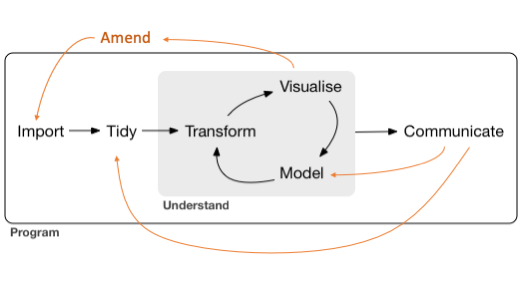

```{r setup, include=FALSE, purl=FALSE}
knitr::opts_chunk$set(echo = TRUE)
```

[R code](22-reproducibility.R)

```{r}
library("tidyverse"); theme_set(theme_bw())
```

# Reproducibility

Before we can perform statistical analysis, we need to have a thorough 
understanding of probability and statistics. 
Primarily this is accomplished through courses previous to this course.
But, we did review some of this material.

- Probability
  - [01-probability](https://www.jarad.me/courses/stat486/slides/01-probability/01-probability.html)
  - [12-distributions](https://www.jarad.me/courses/stat486/slides/12-distributions/12-distributions.html)
  - [13-monte_carlo](https://www.jarad.me/courses/stat486/slides/13-monte_carlo/13-monte_carlo.html)
  - [16-processes](https://www.jarad.me/courses/stat486/slides/16-processes/16-processes.html)
- Statistics
  - [02-statistics](https://www.jarad.me/courses/stat486/slides/02-statistics/02-statistics.html)
  - [03-regression](https://www.jarad.me/courses/stat486/slides/03-regression/03-regression.html)
  - [14-estimators](https://www.jarad.me/courses/stat486/slides/14-estimators/14-estimators.html)
  - [15-intervals](https://www.jarad.me/courses/stat486/slides/15-intervals/15-intervals.html)

R4DS contains a figure demonstrating steps in the data science pipeline. 


We have discussed many steps in this pipeline including

- Import
  - [06-dplyr](https://www.jarad.me/courses/stat486/slides/06-dplyr/06-dplyr.html)
- Tidy
  - [07-wrangling](https://www.jarad.me/courses/stat486/slides/07-wrangling/07-wrangling.html#Data_wrangling)
- Transform
- Visualize
  - [05-ggplot2](https://www.jarad.me/courses/stat486/slides/05-ggplot2/05-ggplot2.html)
- Model
  - 
- Communicate

The suggestion in R4DS is to implement this process progammatically.
This allows modifications to any step can be quickly implemented and all 
downstream steps to be updated accordingly. 
In this course, we have focused on the R programming language to implement 
scripts 

- Program
  - [05-intro_to_r](https://www.jarad.me/courses/stat486/slides/04-intro_to_r/04-intro_to_r.html)
  - [08-objects](https://www.jarad.me/courses/stat486/slides/08-objects/08-objects.html)
  - [09-logical](https://www.jarad.me/courses/stat486/slides/09-logical/09-logical.html)
  - [10-control](https://www.jarad.me/courses/stat486/slides/10-control/10-control.html)
  - [11-functions](https://www.jarad.me/courses/stat486/slides/11-functions/11-functions.html)

